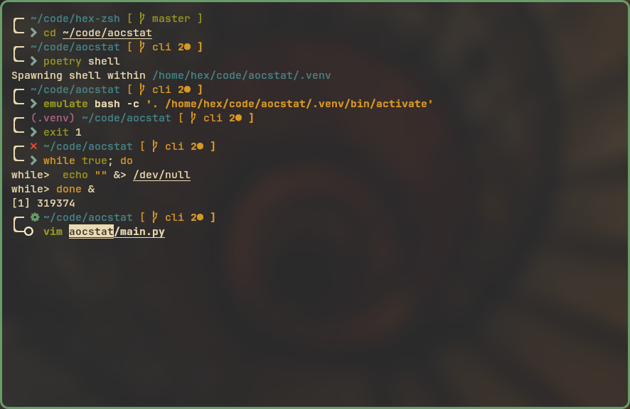

# hex-zsh

This is a zsh theme heavily based on [bira](https://github.com/ohmyzsh/ohmyzsh/wiki/Themes#bira), and [gruvbox-zsh](https://github.com/sbugzu/gruvbox-zsh), which in turn is based on [agnoster](https://gist.github.com/agnoster/3712874).


*The terminal pictured above is [kitty](https://github.com/kovidgoyal/kitty), and also uses [gruvbox](https://github.com/morhetz/gruvbox) and [JetBrainsMono Nerd Font](https://github.com/ryanoasis/nerd-fonts/releases/download/v3.0.1/JetBrainsMono.zip).*

## Installation
1. Install [oh-my-zsh](https://github.com/ohmyzsh/ohmyzsh).
2. Download and install a [Nerd Font](https://nerdfonts.com/).
3. Download `hex.zsh-theme` and put it in `~/.oh-my-zsh/custom/themes/`.
  ``` bash
  curl -L https://raw.githubusercontent.com/hectorBrown/hex-zsh/master/hex.zsh-theme > ~/.oh-my-zsh/custom/themes/hex.zsh-theme
  ```
4. Enable the theme, add the following to your `~/.zshrc` or `~/.oh-my-zsh/custom/custom.zsh` file
  ```
  ZSH_THEME="hex"
  ```
